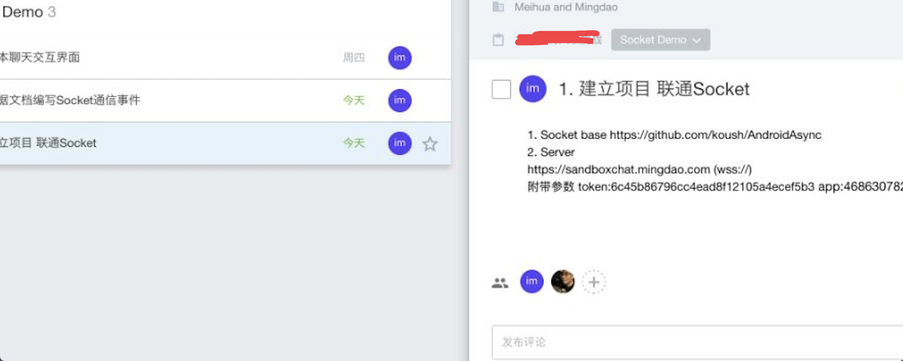

## 程序员，假如你跟我有相同遭遇你会怎么做

### 一次非同寻常的面试经历

### 这两天有件事情让我非常难受，希望网友们能给点建议，下面听我认真叙述一下事情经过

### 就在3月初，我抽了个时间出去面试了一下，也就是`上海万企明道软件有限公司` 这家公司,招聘要求是会android跟react native，正好我也在学习React Native，然后我就去面试了，先是Android跟RN面试官面试我，然后他们的项目经理也面试我，整个面试过程也很顺利，问我期望薪资多少，我说了期望薪资，这位项目经理就说愿意给发offer，但是他说由于公司原因希望我月底入职。
由于我还没离职，所以我就跟我前公司的领导说，我可能要离职了，项目还有哪些需要我做的赶紧安排好。一切进行都很顺利，然后在3月18号左右吧，上海万企明道软件有限公司hr就给我发了offer，offer上面的入职时间是4月5号，但是上海万企明道软件有限公司的项目经理催我赶紧离职，到他们公司上班，ok我就跟我前公司领导提了离职，并在3月22号来到了上海万企明道软件有限公司。
接下来我来叙述一下在这家公司发生的事情：

### 3月22号早上去到这家公司之后，hr就让我填写了一张入职表，这张表需要填写个人信息，包括之前上班的公司名称，以及薪资待遇等，我都如实写了。然后她对我简单做了下培训，就是介绍下公司的制度什么的，之后就给我安排了位置，说先坐下，等下让我过去签合同。ok我就过去了，安排我坐在项目经理旁边，等一会就中午了，然后就和新的同事一起去吃饭了。吃完饭回来之后，
趴在桌子上休息了10几分钟，然后这个项目经理就把我喊到会议室，跟我说Android跟RN交互的工作交给另一个人做了，要求我做消息开发部分(即时通讯)，说是要给我做个测试，给我出了3个题目，我也接受了。（面试的时候问过我了解socket吗，我说了解不多，他说没关系，项目之后的版本主要是Android跟RN交互），接到题目之后，第一个问题是与服务端建立socket连接，本身这个问题并不难，
但是由于题目描述的不清楚，而且对他们业务不了解，给我提供的代码没有任何注释，根本不知道有些参数是干嘛的，所以那天下午我进行的并不顺利。这个题目有个巨坑，我先把他给我出的题目列出来，你去试一下就知道坑不坑了，题目如下：



> 需要携带这两个参数，String token = "6c45b86796cc4ead8f12105a4ecef5b3"; String app = "468630782"; 描述的也不清楚，在我追问下，跟我说完整的请求地址是这样的https://sandboxchat.mingdao.com/mds/1/?token=6c45b86796cc4ead8f12105a4ecef5b3&app=468630782 ，这样是不是就很简单了，完整的地址传进去不就可以建立连接了，其实并
不是这样的，里面有很大的坑，我希望大家可以先尝试做一下就可以体会到我当时的经历了，在后面我会说出答案。我当时发送请求建立连接一直失败，我怀疑是不是后台有问题，我想看后台那边打印什么信息，但是并没有给这个机会，整个过程项目经理还一直盯着看我写代码，他是做ios的，也会一点安卓，他描述的问题我不是很明白，给我库不能用，连接失败，也不给我看后台打印的
信息。他给我的描述是这样的(我发送一个url，然后后台再拼接，然后再返回给我url，怎么拼接成最终的url)， 我当时真的不明白他在说什么，我在想完整的url都已经拼接好了，直接传进去不就好了。所以第一天下午就卡住了，没解决掉。 第二天上班，我去的很早，打算把Socket.io看看，因为我对这块不熟悉，我在想会不会是跟后台有些约定我不知道的，导致无法建立连接，整个
上午我都在看这个，中午的时候我在调试的时候，发现正常拼接的url根本不可能达到https://sandboxchat.mingdao.com/mds/1/?token=6c45b86796cc4ead8f12105a4ecef5b3&app=468630782 这个结果，因为SocketIORequest的源码中是这样的：

```
  public SocketIORequest(String uri, String endpoint, String query, Config config) {
        super(Uri.parse(uri + (query == null ? "" : "?" + query)).buildUpon().encodedPath("/socket.io/1/").build().toString());
        this.config = (config != null) ? config : new Config();
        this.endpoint = endpoint;
        this.query = query;
    }
```

### 注意这行代码  super(Uri.parse(uri + (query == null ? "" : "?" + query)).buildUpon().encodedPath("/socket.io/1/").build().toString());  看到没，里面的拼接参数是socket.io， 而完整的url地址是https://sandboxchat.mingdao.com/mds/1/?token=6c45b86796cc4ead8f12105a4ecef5b3&app=468630782 ，所以得把socket.io
替换成mds 才行。 这可是老外写的库，我哪想到还要改这里，其实应该是后台偷偷把url做了改变，导致我这边必须改源码，这些东西并不是说很难，只是不容易想到，最终在中午的时候还是把这个问题解决了。 在下午的时候，我接着做了第二个问题，就是向一个user发送消息，由于我对业务不了解，有些参数究竟是什么根本不了解，所以就问了一下项目经理，这个参数是表示什么啊等等，
他跟我说了一下参数意义，立马就把问题解决了。但是，

### 就在快要下班的时候，项目经理把我喊到会议室，跟我说本次测试不满意，让我不要来上班了，我感觉自己深深被套路了，首先面试的时候跟我说，让我做Android跟RN交互的事情，然后入职之后让我做消息开发部分，我也是很配合，积极去学习，但是刚来一天 对业务都不了解，做起来肯定没那么顺利，结果连入职的劳动合同还没签，就把我辞退了，我觉得非常不合理。就算是要测试，那么不应该是
在入职之前进行的吗，如果满意了再发offer才对啊。原本我是有一份稳定的工作的，现在害得我失业，我觉得他们处理方式很不合理，简直就是在害人。没有办法了，只能继续投简历找工作，但是我始终觉得他们应该要对这件事负责任的，但是一些法律知识不了解，所以希望网友支个招，谢谢了！


